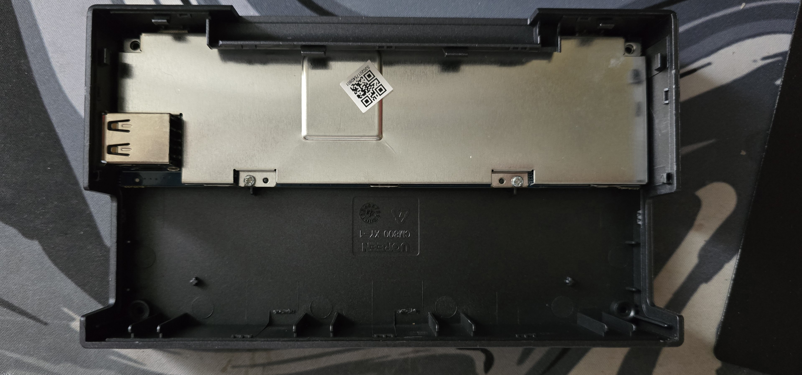

# Teardowns 🛠

> [!WARNING]
> When screwing things, always reverse the direction of the screwing till you hear a click or feel it once or twice, then you can start off screwing in the right direction, as you're now in the correct threads, and you won't ruin your threads, ***ESPEICALLY ON PLASTIC THREADS!!!!***

### UGREEN **CM800** 9 in 1 USB hub
<!--tabs:start-->
#### Front

#### Back

#### Bottom

#### Sides

#### Open Stand

Clips are quite brittle, Always lift off from the sides where there are no clips, or the spaces next to the clips.

#### Inside Top
Feet are reusable, Treat with care! (Do not leave them on the floor, Or eat them..)
Screws are under the feet.

#### PCB Inside bottom

#### QR Code on Shielding

<!--tabs:end -->

### Technicolor Android TV Box
<!-- tabs:start -->

#### **Top View (Shielding On)**

#### **Top View (Shielding Off)**

#### **Chipset / Board**

<!-- tabs:end -->

### Razer Viper V2 Gaming Mouse
Full Credits to Akram
<!-- tabs:start -->

#### **Picture 1**

<!-- tabs:end -->

More on the way.