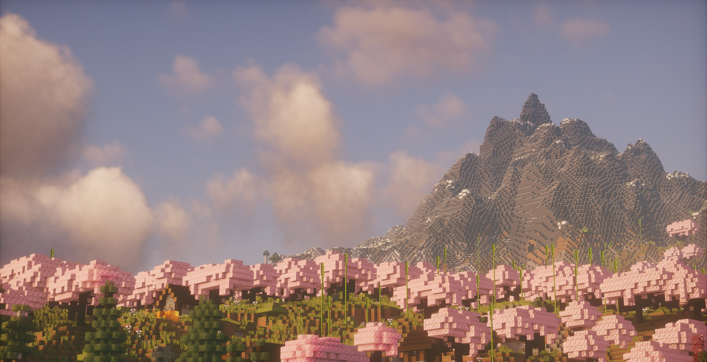

# The Parallel. ⛏

## Where Minecraft Returns to Its Roots

Welcome to The Parallel – an intentionally small, carefully curated Minecraft community where every player matters. In a world of massive servers and endless plugins, we've chosen a different path.

### Our Philosophy

The Parallel isn't just another Minecraft server – it's a deliberate return to what makes Minecraft truly special. We believe that the best experiences come from genuine connections, shared adventures, and the freedom to create without unnecessary complications.

### What Makes Us Different

- **Handpicked Community**: Our server maintains a careful balance with just 10 active players. Each member has been personally interviewed and selected to ensure they share our vision for a collaborative, respectful, and engaging Minecraft experience.

- **Minimal Plugin Philosophy**: We've stripped away the unnecessary complexities that plague many servers. Our carefully selected quality-of-life plugins enhance rather than overshadow the vanilla Minecraft experience.

- **Customized world Generation**: Get ready for the next generation of world generation! Unmatched visual quality and breathtakingly realistic patterns will push the limits of what is possible in Minecraft. You're going to be blown away by this experience, almost unimaginable, and you will hardly believe that this is still Minecraft.

- **Curated Experience**: 
  - Custom world seed chosen for its unique and interesting features
  - Balanced gameplay that encourages exploration and creativity
  - Focus on organic community growth and player interaction
  - Clean, lag-free environment without the bloat of unnecessary modifications

### How to Join

Playing on The Parallel means becoming part of something special. We're looking for players who:
- Value community over competition
- Take pride in their builds and respect others' creations
- Enjoy collaborative projects and shared adventures
- Prefer quality over quantity when it comes to server features

Due to our commitment to maintaining a close-knit community, we have a careful selection process:
1. Apply - DM aftwr on Discord.
1.2 *Incase you were invited by another player, get in contact with aftwr.*
2. Join me for an interview.
3. Share your Minecraft experience and building style.
4. Meet some of our current members, get approved by our members.

### Technical Details

- **Modpack Options**:
  - Our custom-curated modpack (recommended, you will be provided with this pack if asked for it, it is fully open source on request) 
  - Vanilla Minecraft client
  
- **Server Features**:
  - Regular backups
  - Stable, dedicated hosting
  - Active but unintrusive administration
  - Basic quality-of-life enhancements

### Contact

Ready to be part of something different? Reach out to me on Discord.
*The Parallel: Where every player has a story, and every build has a purpose.*

## Server Rules

Our rules are simple but strict. We maintain high standards to ensure everyone has the best possible experience. Remember: You get one chance with us - make it count.

### 1. Zero Tolerance for Cheating
- No hacks, exploits, or unfair advantages
- No X-ray texture packs or similar modifications
- No abuse of game mechanics or glitches
- Restricted to approved modpack or vanilla client only

### 2. Community Conduct
- Treat all players with respect
- No toxic behavior of any kind
- No harassment, discrimination, or bullying
- Keep chat language family-friendly, You're free to swear, but don't direct it at anybody.
- Think before you act - use common sense

### 3. Player Interactions
(These are not rules)
#### Combat & PvP
- PvP must be consensual
- Both parties must agree in writing in the #misc channel
- Format: "I *[player name]* agree to PvP with *[other player]*"
- No surprise attacks or griefing
- No combat logging

#### Property & Items
- Do not take other players' items without permission
- Borrowing requires written consent in #misc channel
- Format: "I *[player name]* agree to lend *[items]* to *[other player]*"
- Return borrowed items in the same condition unless agreed upon
- Respect player builds and territories

### 4. Privacy & Security
- No sharing personal information
- No doxxing (immediate permanent ban)
- Keep conversations appropriate
- Report suspicious behavior to staff
- Protect your own account security

## Enforcement

### Punishment Policy
- All punishments are final
- No appeals except in extreme circumstances
- Zero tolerance for repeat offenses
- Bans are permanent unless explicitly stated otherwise
- Staff decisions are not up for debate

### Reporting
- Use appropriate channels to report issues
- Provide evidence when possible
- False reports will be treated as rule violations
- Staff will investigate all legitimate reports

## Important Notes

- These rules apply to all players equally
- Staff reserve the right to remove any player at any time
- Rules may be updated with notice to the community
- "I didn't know" is not an acceptable excuse
- Being nice isn't hard - if you find it difficult, this isn't the server for you

---

*By playing on The Parallel, Reading, laying eyes on the pixels of which that display this webpage / document, and/or laying eyes on any sort of property that is owned by aftwr's Ventureworks "The Parallel", you acknowledge you agree to follow these rules and accept any consequences for breaking them.  We are committed to maintaining a positive environment for all users.*